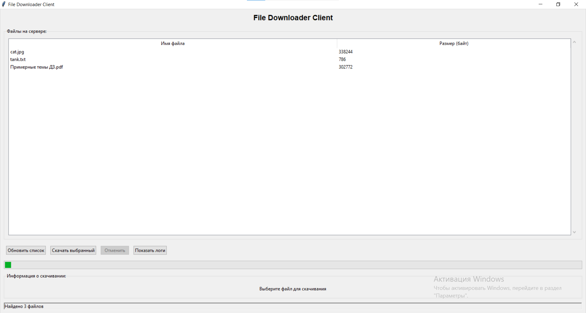
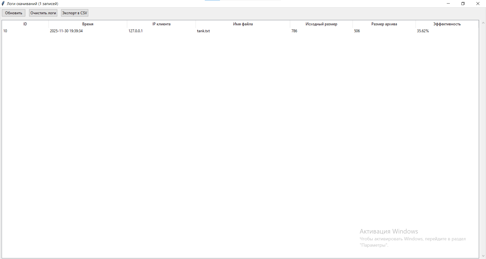

# Вариант 12.
Разработать ПО, которое бы позволяло скачивать файлы с сервера при этом предварительно архивируя их (любыми
средствами сервера). При скачивании на экран должны выводиться истинный размер файла, размер сжатого файла и
коэффициент сжатия. Все действия должны осуществляться через графический UI. Лог работы должен храниться в БД.

## Интерфейс ПО

## Результат скачивания файла с сервера с предварительным архивированием

## Лог работы

